```{r setup, include=FALSE}
knitr::opts_chunk$set(echo = TRUE)
```

###PART A  

Let Random Clicker be R  
    Truthful Clicker be T  
We know from the survey result that P(Y)= 0.65 and P(N) = 0.35  
Also expected fraction of random clickers is 0.3  
Therefore, P(R) = 0.3  
Hence, P(T) = 1-0.3 = 0.7      (from total probability)  

Given that Random clickers would click either one with equal probability  
So, P(Y|R) = 0.5  
    P(N|R) = 0.5  

P(Y|T) = ??  
P(Y|T) = (P(Y)*P(T|Y))/P(T)  

P(T|Y) is unknown in this equation   

P(Y|R) = (P(R|Y)*P(Y))/P(R)  
   0.5 = (P(R|Y)*0.65)/0.3  
P(R|Y) = (0.5*0.3)/0.65  
P(R|Y) = 0.15/0.65  

Therefore, P(T|Y) = 1-(0.15/0.65)  
           P(T|Y) = 0.5/0.65  
           
P(Y|T) = (P(Y)*P(T|Y))/P(T)  
       = (0.65*0.5)/(0.65*0.7)  
       = 5/7  
       
###5 out of 7 truthful clickers answered yes.
```{r cars}

```
###PART B
Let disease be D  
    Postive be P  
    Negative be N  
    No disease be ND  
    
    P(P|D) = 0.993   
    P(N|ND) = 0.9999   
    P(D) = 0.000025  
    
    P(D|P) = ??  
    
    P(D|P) = (P(P|D) * P(D))/ P(P)  
    
    P(P) = P(P,D) + P(P,ND)  
         = P(P|D) * P(D) + P(P|ND) * P(ND)   
         = (0.993 * 0.000025) + (0.0001 * 0.999975)  
         = 0.000024825 + 0.0000999975  
    P(P) = 0.0001248225  
  
  P(D|P) = (0.993 * 0.000025) / 0.0001248225  
         = .000024825 / 0.0001248225  
         = 0.1988  

###The probability that they have the disease if tested positive is 0.1988  

###There is a huge possibility of false positives due to which this test can't be accepted   universally. 


###Green Buildings
```{r,message=FALSE}
library(dplyr)
library(plotly)
```

```{r,message=FALSE}
####importing csv
green_build<-read.csv('greenbuildings.csv',header = TRUE,stringsAsFactors = FALSE)
green_build$green_rating<-as.character(green_build$green_rating)
green_build$amenities<-as.character(green_build$amenities)
green_build$cluster<-as.character(green_build$cluster)
green_build$net<-as.character(green_build$net)
green_build$renovated<-as.character(green_build$renovated)
#### Let's combine class a and class b
green_build$class<-ifelse(green_build$class_a == 1,'class_a',ifelse(green_build$class_b == 1,'class_b','class_c'))
####removing unwanted columns
green_build<-green_build[,-c(10,11)]
```
### Data cleanup complete

### Now let's find out some correlations.  

How 'Stories' is related to 'size' of building?
```{r,message=FALSE}
p <- plot_ly(green_build, x = green_build$Rent, y = green_build$size) %>%
   layout(
    title = "Rent vs size",
      xaxis = list(title = "Rent"),
      yaxis = list(title = "Size")
    )

```
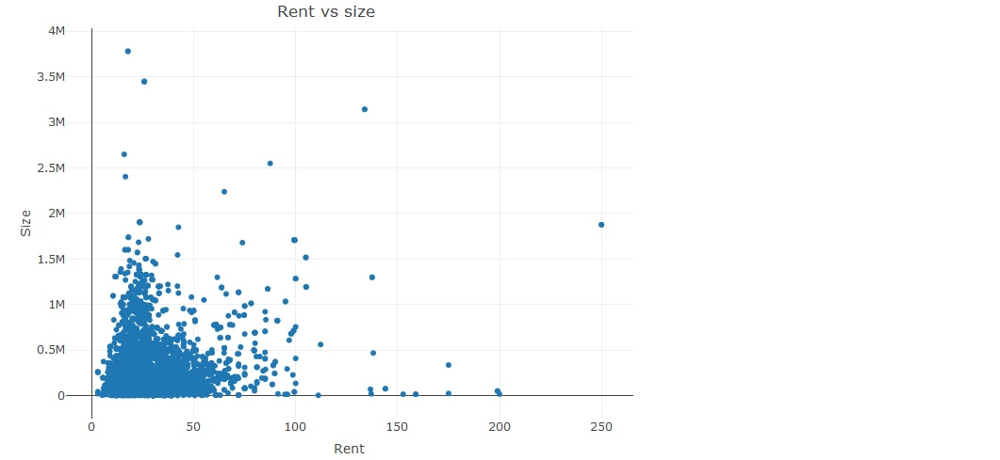 


We can see a clear relation between the two. If a building is small in size, rent per square foot can also be less. So it might not be a good estimator of rent for huge building.

### Moving on to other variables, and checking relation between few more variables.  

###Rent and Stories
```{r,message=FALSE}
temp <- green_build %>% select(stories,Rent)
temp <- na.omit(temp)
p<-plot_ly(temp, x = temp$Rent, y = temp$stories)%>%
   layout(
    title = "Stories vs Rent",
      xaxis = list(title = "Rent"),
      yaxis = list(title = "Stories")
    )

```

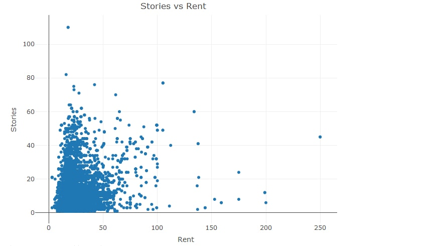

Stories can also affect the rent as we can see.   

### Rent and age
```{r,message=FALSE}
temp <- green_build %>% select(age,Rent)
temp <- na.omit(temp)
p<-plot_ly(temp, x = temp$Rent, y = temp$age)%>%
   layout(
    title = "Rent vs Age",
      xaxis = list(title = "Rent"),
      yaxis = list(title = "Age")
    )

```

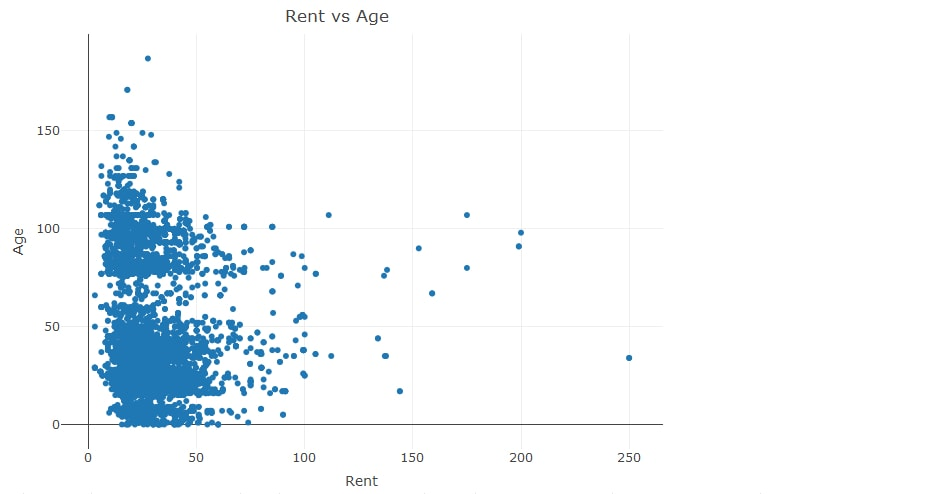

As the age of the building increases, it's rent goes donw. This effect has not been considered by the Excel guru. The rent has been considered constant over 30 years which might not be a correct assumption. 

```{r,message=FALSE}
set.seed(100)
cluster_random <- sample(green_build$cluster,20)
temp<-green_build[green_build$cluster %in% cluster_random,]
p<-plot_ly(temp, x = temp$Rent, y = temp$empl.gr,color = temp$cluster)%>%
   layout(
    title = "Rent vs empl_gr",
      xaxis = list(title = "Rent"),
      yaxis = list(title = "empl_gr")
    )

```

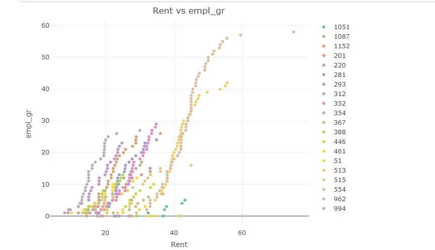 

Here we see a clear clustering pattern while considering emplyment growth rate which tells us that it is an important factor. Rent increases as employment growth increases. 

Another case be that the employment growth of a region can decrease with time and rent can go low because of that. That factor has not been considered by the guru which makes his case weak.
```{r,message=FALSE}
temp <- green_build %>% select(amenities,Rent)
temp <- na.omit(temp)
p<-plot_ly(temp, x = temp$Rent, color = temp$amenities, type = "box")%>%
   layout(
    title = "Rent vs Amenities",
      xaxis = list(title = "Rent"),
      yaxis = list(title = "Amenities")
    )

```

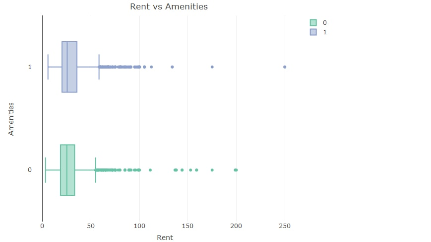

We can see a correlation between amenities and rent. Buildings having atleast one amenity have higher rent on average.

```{r}
green_build$Rating<-ifelse(green_build$Energystar == 1, 1,ifelse(green_build$LEED == 1,2,0))
#plot_ly(green_build, y=green_build$Rent, x= green_build$green_rating, type = "box")
```
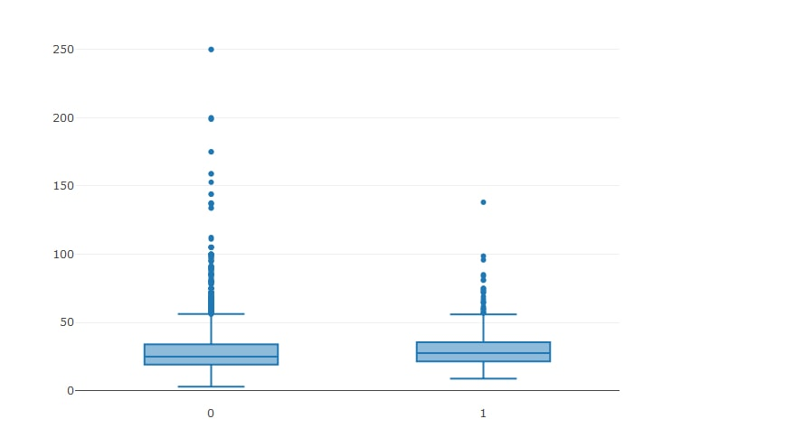

We can see that green buildings have high rent compared to non green.  

```{r}
#plot_ly(green_build, y=green_build$Rent, x=green_build$Rating,  type = "box")
```

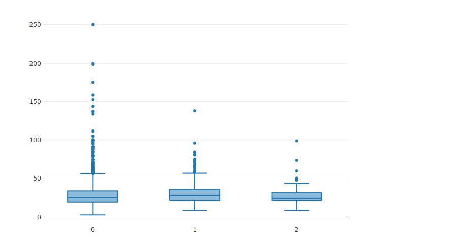

Along with being a green building, it also matters whether it is LEED star rating or ENERGY star rating.
```{r,message=FALSE}
temp <- green_build %>% select(class,Rent)
temp <- na.omit(temp)
p<-plot_ly(temp, x = temp$Rent, color = temp$class, type = "box")%>%
   layout(
    title = "Rent vs class",
      xaxis = list(title = "Rent"),
      yaxis = list(title = "class")
    )

summary(green_build)
```

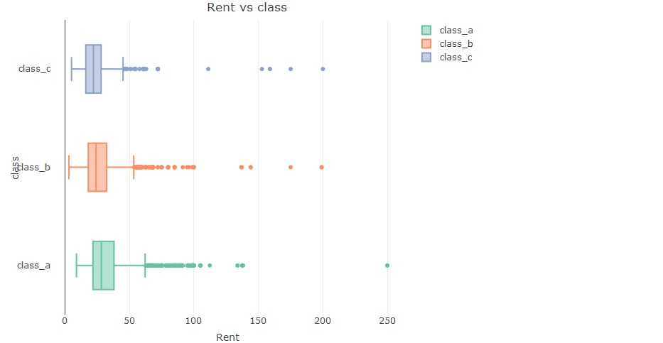 


We can see that Class A has highest rent, followed by class B and then class C because Class A has better quality buildings compared to Class B and Class C. This also shows that Class can be a big contributor in high rent of green buildings.  
Hence, just having a green building is not a sole predictor of rent.

```{r,message=FALSE}
temp <- green_build %>% select(net,Rent)
temp <- na.omit(temp)
p<-plot_ly(temp, x = temp$Rent, color = temp$net, type = "box")%>%
   layout(
    title = "Rent vs net",
      xaxis = list(title = "Rent"),
      yaxis = list(title = "net")
    )

```

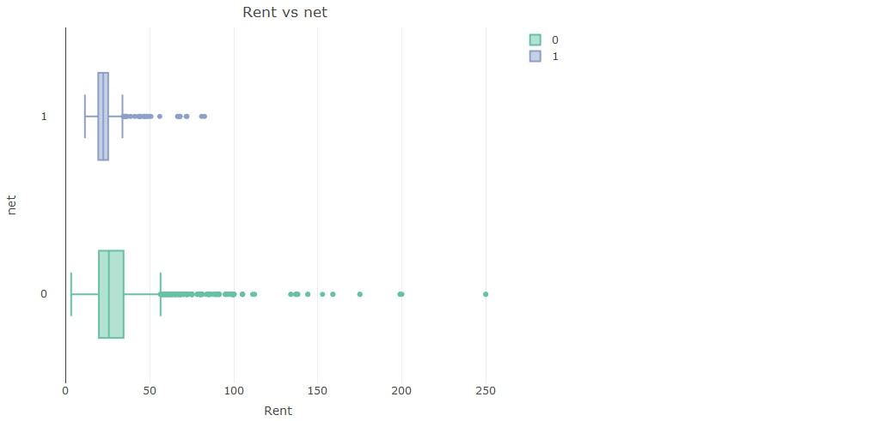 

Clearly, if the tenants are paying the utility bill on their own, the rent they have to pay will be lower. But that doesn't give any insight about whether it's going to tell us whether green building is better or not.
```{r,message=FALSE}
temp <- green_build %>% filter(net == 1)
temp1 <- temp %>% select(Rent,Electricity_Costs)
p<-plot_ly(temp1, x = temp1$Rent, y = temp1$Electricity_Costs)%>%
   layout(
    title = "Rent vs Electricity_Costs",
      xaxis = list(title = "Rent"),
      yaxis = list(title = "Electricity_Costs")
    )

```

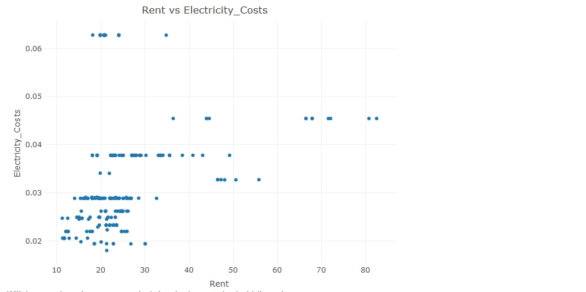

With incraese in rent, we see a gradual stepwise increase in electricity costs. 
```{r,message=FALSE}
green_build_occ <- green_build %>% select(cluster,leasing_rate) %>% group_by(cluster) %>%  summarise(mean_occ = mean(leasing_rate))
p<-plot_ly(green_build_occ, x = green_build_occ$mean_occ, type = "box")%>%
   layout(
    title = "Mean occupancy",
      xaxis = list(title = "mean_occ")
    )

```

.jpg)

The mean of occupancy from the above box plot is 84% which shows that the prediction of minimum occupancy of 90% is a bit on the higher end. We can assume the occupancy to be around 75% for prediction purpose.  
```{r,message=FALSE}
temp1 <- temp %>% select(Rent,Precipitation)
p<-plot_ly(temp1, x = temp1$Rent, y = temp1$Precipitation)%>%
   layout(
    title = "Rent vs Precipitation",
      xaxis = list(title = "Rent"),
      yaxis = list(title = "Precipitation")
    )

```

.jpg)

```{r,message=FALSE}


temp1 <- temp %>% select(Rent,hd_total07)
p<-plot_ly(temp1, x = temp1$Rent, y = temp1$hd_total07)%>%
   layout(
    title = "Rent vs hd_total07",
      xaxis = list(title = "Rent"),
      yaxis = list(title = "hd_total07")
    )

```

.jpg)

```{r,message=FALSE}
temp1 <- temp %>% select(Rent,cd_total_07)
p<-plot_ly(temp1, x = temp1$Rent, y = temp1$cd_total_07)%>%
   layout(
    title = "Rent vs cd_total_07",
      xaxis = list(title = "Rent"),
      yaxis = list(title = "cd_total_07")
    )

```

.jpg)

We see an increase in rent with an increase in Precipitation, Heating days and cooling days (ignoring the outliers)  

After checking for all the correlations and variable reductions, we decided to go ahead with employment growth rate, stories, Precipitation and heating and cooling days.  

Hence we look for these values for our new building on East Cesar Chavez. 

###Now we try to classify our new building into a cluster. First removing missing values
```{r,message=FALSE}
greendata=green_build[which(!(is.na(green_build$empl_gr))),]
```
###Next we classify the building using least rmse
```{r,message=FALSE}
table = greendata %>% group_by(cluster) %>% summarise(mean_empl_gr = mean(empl_gr),
                       mean_cd = mean(cd_total_07),
                       mean_hd = mean(hd_total07),
                       mean_ppt = mean(Precipitation),
                       mean_stories = mean(stories))
table['stories'] = 15
table['emply_growth']	= 2.8
table['Precipitation_new']	= 34.25
table['Heating_degree_days'] =	1541
table['Cooling_degree_days']	= 3130
x1 = max(table[,2])-min(table[,2])
x2 = max(table[,3])-min(table[,3])
x3 = max(table[,4])-min(table[,4])
x4 = max(table[,5])-min(table[,5])
x5 = max(table[,6])-min(table[,6])
View(table)
table['rmse1']= ((table[,2]-table[,8])/x1)^2
table['rmse2']= ((table[,3]-table[,11])/x2)^2
table['rmse3']= ((table[,4]-table[,10])/x3)^2
table['rmse4']= ((table[,5]-table[,9])/x4)^2
table['rmse5']= ((table[,6]-table[,7])/x5)^2

table['final_rmse']=sqrt((table[,12]+table[,13]+table[,14]+table[,15]+table[,16])/5)
max(table['final_rmse'])
min(table['final_rmse'])
newdata <- table[order(table$final_rmse),] 
View(newdata)
final_data = newdata %>% select(cluster,final_rmse)
final_cluster= green_build %>% filter(cluster == 394)
View(final_cluster)
```
In the final cluster, we can see that green building has the highest rent but we can also see that the buildings having highest rent are also Class A buildings. As we have seen above, CLass and rent have high correlation which can be a cause for high rent.This relation was not considered in Excel guru's exploration which can be misleading.  

The maximum for non green building in cluster 394 is $25.46 and for green building it's $29.37 which gives us extra $3.91 dollars per square foot of the building. Which is higher than what the Excel guru estimated. Hence, we can get the investment back in (5000000/(250000*3.91*.75)) 6.8 years considering the occupancy of 75%.

But there are few assumptions that need to be considered here:  
The employment growth rate will not go down. In 30 years, employment growth can go up or down. It is assumed constant. 
Also an important factor to be considered is the time value of money and the rent in a particular geographic location changes depending on the development of that location and what impact it goes through, in the years. As there is no sufficient details provided on these parameters it is safe to assume our hypothesis will hold in the given conditions.

```{r}
```
###BOOTSTRAPPING
```{r,message=FALSE}
library(mosaic)
library(quantmod)
library(foreach)
library(plotly)
```

```{r,message = FALSE,warning=FALSE}
mystocks = c("SPY", "TLT", "LQD", "EEM", "VNQ")
myprices = getSymbols(mystocks, from = "2007-01-01")

# Adjust for splits and dividends
SPYa = adjustOHLC(SPY)
TLTa = adjustOHLC(TLT)
LQDa = adjustOHLC(LQD)
EEMa = adjustOHLC(EEM)
VNQa = adjustOHLC(VNQ)
```

```{r}
plot(ClCl(SPYa))
```  

There is moderate risk/return assiciated with SPY as the percent difference between everyday closing price does not seem to be too high

```{r}
plot(ClCl(TLTa)) 
```  

TLT follows the most fluctuating trend with a large difference between closing prices everyday. Hence, there is higher risk/return associated with such assets

```{r}
plot(ClCl(LQDa))
```  
Trend does not seem to be fluctuating, low risk/return

```{r}
plot(ClCl(EEMa)) 
```  
Trend seems almost flat. Hence, lowest risk/return associated

```{r}
plot(ClCl(VNQa)) 
```  
Behaves just like SPY, moderate risk/return associated 

## Performance of assets over last year
```{r,warning=FALSE}
df <- data.frame(Date=index(SPYa),coredata(SPYa))
df <- tail(df, 365)
p <- df %>%
  plot_ly(x = ~Date, type="candlestick",
          open = ~SPY.Open, close = ~SPY.Close,
          high = ~SPY.High, low = ~SPY.Low) %>%
  add_lines(y = ~SPY.Open, line = list(color = 'black', width = 0.75)) %>%
  layout(showlegend = FALSE)

```  

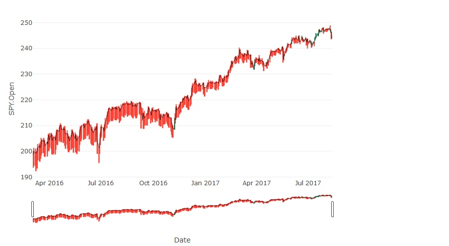

Trend shows asset price increasing over time with moderate risk/return  

```{r,warning=FALSE}
df <- data.frame(Date=index(TLTa),coredata(TLTa))
df <- tail(df, 365)
p <- df %>%
  plot_ly(x = ~Date, type="candlestick",
          open = ~TLT.Open, close = ~TLT.Close,
          high = ~TLT.High, low = ~TLT.Low) %>%
  add_lines(y = ~TLT.Open, line = list(color = 'black', width = 0.75)) %>%
  layout(showlegend = FALSE)

```  

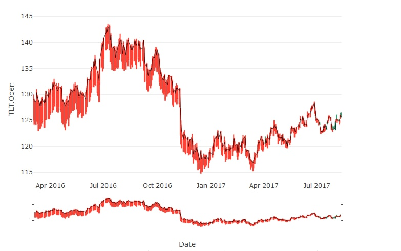


TLT does not show an increasing trend over time. Although it seems to be stabilizing from the past couple of months  

```{r,warning=FALSE}
df <- data.frame(Date=index(LQDa),coredata(LQDa))
df <- tail(df, 365)
p <- df %>%
  plot_ly(x = ~Date, type="candlestick",
          open = ~LQD.Open, close = ~LQD.Close,
          high = ~LQD.High, low = ~LQD.Low) %>%
  add_lines(y = ~LQD.Open, line = list(color = 'black', width = 0.75)) %>%
  layout(showlegend = FALSE)

```  

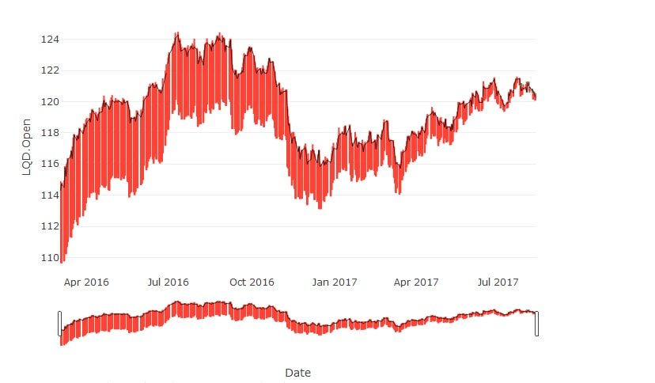


LQD is gaining for the past months giving moderate returns  

```{r,warning=FALSE}
df <- data.frame(Date=index(EEMa),coredata(EEMa))
df <- tail(df, 365)
p <- df %>%
  plot_ly(x = ~Date, type="candlestick",
          open = ~EEM.Open, close = ~EEM.Close,
          high = ~EEM.High, low = ~EEM.Low) %>%
  add_lines(y = ~EEM.Open, line = list(color = 'black', width = 0.75)) %>%
  layout(showlegend = FALSE)

```  

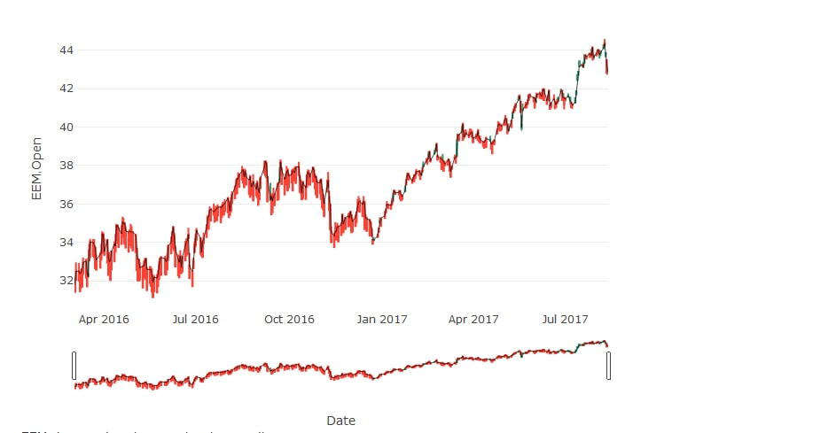

EEM shows a steep increase in price over time  

```{r,warning=FALSE}
df <- data.frame(Date=index(VNQa),coredata(VNQa))
df <- tail(df, 365)
p <- df %>%
  plot_ly(x = ~Date, type="candlestick",
          open = ~VNQ.Open, close = ~VNQ.Close,
          high = ~VNQ.High, low = ~VNQ.Low) %>%
  add_lines(y = ~VNQ.Open, line = list(color = 'black', width = 0.75)) %>%
  layout(showlegend = FALSE)

```  

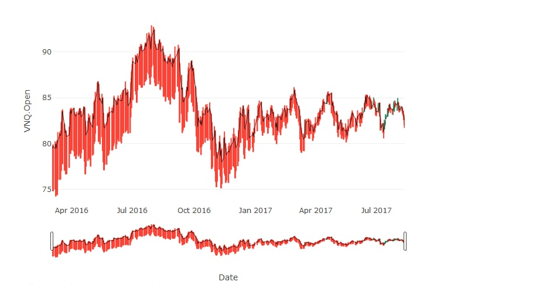


Plotting risk/return of individual assets  

### SPY
```{r}
set.seed(100)
all_returns_spy = cbind(ClCl(SPYa))
all_returns_spy = as.matrix(na.omit(all_returns_spy))
initial_wealth = 100000
sim1_spy = foreach(i=1:1000, .combine='rbind') %do% {
  total_wealth = initial_wealth
  weights = c(1)
  holdings = weights * total_wealth
  n_days = 20
  wealthtracker = rep(0, n_days)
  for(today in 1:n_days) {
    return = mosaic::resample(all_returns_spy, 1, orig.ids=FALSE)
    holdings = holdings + holdings*return
    total_wealth = sum(holdings)
    wealthtracker[today] = total_wealth
  }
  wealthtracker
}

mean(sim1_spy[,n_days])
sd(sim1_spy[,n_days])

```  
### TLT
```{r}
set.seed(100)
all_returns_tlt = cbind(ClCl(TLTa))
all_returns_tlt = as.matrix(na.omit(all_returns_tlt))
initial_wealth = 100000
sim1_tlt = foreach(i=1:1000, .combine='rbind') %do% {
  total_wealth = initial_wealth
  weights = c(1)
  holdings = weights * total_wealth
  n_days = 20
  wealthtracker = rep(0, n_days)
  for(today in 1:n_days) {
    return = mosaic::resample(all_returns_tlt, 1, orig.ids=FALSE)
    holdings = holdings + holdings*return
    total_wealth = sum(holdings)
    wealthtracker[today] = total_wealth
  }
  wealthtracker
}

mean(sim1_tlt[,n_days])
sd(sim1_tlt[,n_days])

```

### LQD
```{r}
set.seed(100)
all_returns_lqd = cbind(ClCl(LQDa))
all_returns_lqd = as.matrix(na.omit(all_returns_lqd))
initial_wealth = 100000
sim1_lqd = foreach(i=1:1000, .combine='rbind') %do% {
  total_wealth = initial_wealth
  weights = c(1)
  holdings = weights * total_wealth
  n_days = 20
  wealthtracker = rep(0, n_days)
  for(today in 1:n_days) {
    return = mosaic::resample(all_returns_lqd, 1, orig.ids=FALSE)
    holdings = holdings + holdings*return
    total_wealth = sum(holdings)
    wealthtracker[today] = total_wealth
  }
  wealthtracker
}

mean(sim1_lqd[,n_days])
sd(sim1_lqd[,n_days])

```  

### EEM
```{r}
set.seed(100)
all_returns_eem = cbind(ClCl(EEMa))
all_returns_eem = as.matrix(na.omit(all_returns_eem))
initial_wealth = 100000
sim1_eem = foreach(i=1:1000, .combine='rbind') %do% {
  total_wealth = initial_wealth
  weights = c(1)
  holdings = weights * total_wealth
  n_days = 20
  wealthtracker = rep(0, n_days)
  for(today in 1:n_days) {
    return = mosaic::resample(all_returns_eem, 1, orig.ids=FALSE)
    holdings = holdings + holdings*return
    total_wealth = sum(holdings)
    wealthtracker[today] = total_wealth
  }
  wealthtracker
}

mean(sim1_eem[,n_days])
sd(sim1_eem[,n_days])
```  

### VNQ
```{r}
set.seed(100)
all_returns_vnq = cbind(ClCl(VNQa))
all_returns_vnq = as.matrix(na.omit(all_returns_vnq))
initial_wealth = 100000
sim1_vnq = foreach(i=1:1000, .combine='rbind') %do% {
  total_wealth = initial_wealth
  weights = c(1)
  holdings = weights * total_wealth
  n_days = 20
  wealthtracker = rep(0, n_days)
  for(today in 1:n_days) {
    return = mosaic::resample(all_returns_vnq, 1, orig.ids=FALSE)
    holdings = holdings + holdings*return
    total_wealth = sum(holdings)
    wealthtracker[today] = total_wealth
  }
  wealthtracker
}

mean(sim1_vnq[,n_days])
sd(sim1_vnq[,n_days])
```  

```{r}
data.frame('Portfolio' = c('SPY','TLT','LQD','EEM','VNQ'), 'Mean' = c(mean(sim1_spy[,n_days]),mean(sim1_tlt[,n_days]),mean(sim1_lqd[,n_days]),mean(sim1_eem[,n_days]),mean(sim1_vnq[,n_days])),
              'Standard Deviation' = c(sd(sim1_spy[,n_days]),sd(sim1_tlt[,n_days]),sd(sim1_lqd[,n_days]),sd(sim1_eem[,n_days]),
                                       sd(sim1_vnq[,n_days])))
```  


VNQ has moderate risk/return associated with it as is presented by results for the past 1 year


Hence the following portfolio exhibit different porperties
1. Equity(SPY): Gives moderate risk/return with returns increasing over time    
2. Treasury bonds (TLT): This follows a fluctuating trend with higher risk/return associated with it.   
3. Corporate bonds (LQD): LQD gives low/moderate returns with stable plots
4. Equities (EEM): Shows a fluctuating trend and is highly volatile. Gives highest returns with highest deviation  
5. Real Estate (VNQ): this behaves just like SPY with moderate risk/return associated with it.

### Correlation  

```{r,warning=FALSE}
# Combine close to close changes in a single matrix
all_returns = cbind(ClCl(SPYa),ClCl(TLTa),ClCl(LQDa),ClCl(EEMa),ClCl(VNQa))
head(all_returns)
all_returns = as.matrix(na.omit(all_returns))
# These returns can be viewed as draws from the joint distribution
pairs(all_returns)
```  
SPY and VNQ share a high positive correlation  

```{r}
# An autocorrelation plot: nothing there
acf(all_returns[,1]) ### how functions perform as a function of time, any correlation
acf(all_returns[,2])
acf(all_returns[,3])
acf(all_returns[,4])
acf(all_returns[,5])

```  
None of the assets are time dependent or are related to it'previous performance  

```{r}
# The sample correlation matrix
cor(all_returns) ### if any stocks are related to each other, give high or low returns
```  
Keeping SPY and VNQ together for a portfolio increases votality as they move in same direction.  
Such portfolio could result into either really huge profits or loss.  
A safe portfolio should have variables with low correlation because even if one asset is losing, the other having low correlation might not move in the same direction. Hence, overall we might not face such huge loss or gains.  
TLT shares low correlation with almost all other assets. Hence, it could be a good asset to include as a part of safe portfolio.
Bonds(TNT, LQD) have low correlation with equity (SPY, EEM). Hence these together could be a part of safe portfolio. 
Also, real estate has low correlation with stock market which leads to low exposure to risk and high yields. 

### Even split

```{r}
set.seed(100)
all_returns = cbind(ClCl(SPYa),ClCl(TLTa),ClCl(LQDa),ClCl(EEMa),ClCl(VNQa))
all_returns = as.matrix(na.omit(all_returns))
initial_wealth = 100000
sim1 = foreach(i=1:5000, .combine='rbind') %do% {
  total_wealth = initial_wealth
  weights = c(0.2, 0.2, 0.2, 0.2, 0.2)
  holdings = weights * total_wealth
  n_days = 20
  wealthtracker = rep(0, n_days)
  for(today in 1:n_days) {
    return = mosaic::resample(all_returns, 1, orig.ids=FALSE)
    holdings = holdings + holdings*return
    total_wealth = sum(holdings)
    wealthtracker[today] = total_wealth
  }
  wealthtracker
}

head(sim1)
hist(sim1[,n_days], 25)
even_sd<-sd(sim1[,n_days])
# Profit/loss
even_mean<-mean(sim1[,n_days])
#hist(sim1[,n_days]- initial_wealth, breaks=30)

# Calculate 5% value at risk
even_var<-quantile(sim1[,n_days], 0.05) - initial_wealth
####money being lost 5% of the time
```  

### Safe split

```{r}
set.seed(100)
all_returns_safe = cbind(ClCl(LQDa),ClCl(TLTa),ClCl(SPYa))
all_returns_safe = as.matrix(na.omit(all_returns_safe))
initial_wealth = 100000
sim1 = foreach(i=1:5000, .combine='rbind') %do% {
  total_wealth = initial_wealth
  weights = c(0.25,0.25,0.5)
  holdings = weights * total_wealth
  n_days = 20
  wealthtracker = rep(0, n_days)
  for(today in 1:n_days) {
    return = mosaic::resample(all_returns_safe, 1, orig.ids=FALSE)
    holdings = holdings + holdings*return
    total_wealth = sum(holdings)
    wealthtracker[today] = total_wealth
  }
  wealthtracker
}

head(sim1)
hist(sim1[,n_days], 25)
safe_sd<-sd(sim1[,n_days])
# Profit/loss
safe_mean<-mean(sim1[,n_days])
hist(sim1[,n_days]- initial_wealth, breaks=30)

# Calculate 5% value at risk
safe_var<-quantile(sim1[,n_days], 0.05) - initial_wealth
```

### aggresive portfolio

```{r}
set.seed(100)
all_returns_agg = cbind(ClCl(VNQa),ClCl(EEMa)) 
all_returns_agg = as.matrix(na.omit(all_returns_agg))
initial_wealth = 100000
sim1 = foreach(i=1:5000, .combine='rbind') %do% {
  total_wealth = initial_wealth
  weights = c(0.5,0.5)
  holdings = weights * total_wealth
  n_days = 20
  wealthtracker = rep(0, n_days)
  for(today in 1:n_days) {
    return = mosaic::resample(all_returns_agg, 1, orig.ids=FALSE)
    holdings = holdings + holdings*return
    total_wealth = sum(holdings)
    wealthtracker[today] = total_wealth
  }
  wealthtracker
}

head(sim1)
hist(sim1[,n_days], 25)
aggressive_sd<-sd(sim1[,n_days])
# Profit/loss
aggressive_mean<-mean(sim1[,n_days])
hist(sim1[,n_days]- initial_wealth, breaks=30)

# Calculate 5% value at risk
agg_var<-quantile(sim1[,n_days], 0.05) - initial_wealth
```

```{r}
portfolio<-data.frame('Portfolio_type' = c('Even','Safe','Aggresive'),'Mean' = c(even_mean,safe_mean,aggressive_mean),'Variance' = c(even_sd,safe_sd,aggressive_sd), 'VAR'=c(even_var,safe_var,agg_var))
portfolio
```

```{r}
```

##Market Segmentation
```{r}
library(plotly)
library(ggplot2)
library(LICORS) 
library(foreach)
library(mosaic)
social_mktg<-read.csv('social_marketing.csv',header = TRUE,stringsAsFactors = FALSE,row.names=1)
names(social_mktg)
```

#### Remove columns for categories which won't be targeted

```{r}
social_mktg<-social_mktg[,-c(1,5,35,36)]
```

```{r}
x<-colSums(social_mktg)
```
####Counting the total number of tweets about each particular category
####Photo sharing was tweeted on the most number of times while small_business was the least


```{r}
correlation<-cor(social_mktg,method = 'pearson')
```

####To check if any related variables are tweeted about together and group them

```{r}
p1<- plot_ly(alpha = 0.6) %>%
  add_histogram(x = social_mktg$food,name = 'food') %>%
  add_histogram(x = social_mktg$cooking, name = 'cooking') %>%
  layout(barmode = "overlay")

```

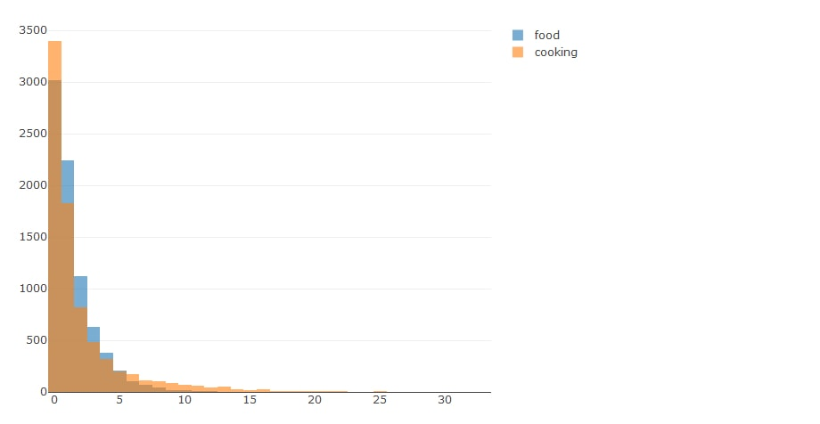 

#### Very less correlation between cooking and food(correlation=0.06768445), as seen from the plot too, they are not tweeted together


```{r}
p2<- plot_ly(alpha = 0.6) %>%
  add_histogram(x = social_mktg$politics, name = 'politics') %>%
  add_histogram(x = social_mktg$news, name = 'news') %>%
  layout(barmode = "overlay")
```


#### Politics and news have a very high correlation(0.5618422) as seen from the plot

```{r}
p3<- plot_ly(alpha = 0.6) %>%
  add_histogram(x = social_mktg$politics, name = 'politics') %>%
  add_histogram(x = social_mktg$current_events, name = 'current event') %>%
  layout(barmode = "overlay")

```


#### Very less correlation between politics and current events(correlation=0.06828273), as seen from the plot too, they are not tweeted together

```{r}
p4<- plot_ly(alpha = 0.6) %>%
  add_histogram(x = social_mktg$religion, name = 'religion') %>%
  add_histogram(x = social_mktg$parenting, name = 'parenting') %>%
  layout(barmode = "overlay")

```


####Religion and parenting have a very high correlation(0.6555973) as seen from the plot

```{r}
p5<- plot_ly(alpha = 0.6) %>%
  add_histogram(x = social_mktg$health_nutrition, name = 'health nutrition') %>%
  add_histogram(x = social_mktg$outdoors, name = 'outdoor') %>%
  layout(barmode = "overlay")

```


####Health nutrition and outdoors have a very high correlation(0.6082254) as seen from the plot

```{r}
p6<- plot_ly(alpha = 0.6) %>%
  add_histogram(x = social_mktg$college_uni, name = 'college uni') %>%
  add_histogram(x = social_mktg$online_gaming, name = 'online gaming') %>%
  layout(barmode = "overlay")

```


####College_uni and online gaming have a very high correlation(0.7728393) as seen from the plot


###
```{r, message=FALSE, warning=FALSE}
attach(social_mktg)
social_mktgs= scale(social_mktg, center=TRUE, scale=TRUE)
```


####Extract the centers and scales from the rescaled data (which are named attributes)

```{r}
mu = attr(social_mktgs,"scaled:center")
sigma = attr(social_mktgs,"scaled:scale")

```


####Compute and plot wss for k = 2 to k = 15 through elbow method to find optimal K value

```{r}
k.max <- 15
data <- social_mktgs
sumofsquares <- sapply(1:k.max, 
              function(k){kmeans(data, k, nstart=30,iter.max = 15 )$tot.withinss})
sumofsquares
plot(1:k.max, sumofsquares,
     type="b", pch = 20, frame = FALSE, 
     xlab="Number of clusters K",
     ylab="Total within-clusters sum of squares")
```

###From the plot it is visible that the K value of 6 is the best choice for the given dataset

```{r}
set.seed(12345)
clust = kmeanspp(social_mktgs, k=6, nstart=25)

```


```{r}
qplot(food, cooking, data=social_mktg, color=factor(clust$cluster))

```

```{r}
qplot(news, politics, data=social_mktg, color=factor(clust$cluster))
```

```{r}
qplot(politics, current_events, data=social_mktg, color=factor(clust$cluster))
```

```{r}
qplot(religion, parenting, data=social_mktg, color=factor(clust$cluster))
```

```{r}
qplot(health_nutrition, outdoors, data=social_mktg, color=factor(clust$cluster))
```

```{r}
qplot(college_uni, online_gaming, data=social_mktg, color=factor(clust$cluster))
```

#### As seen from the clusters pattern, quite similar to the correlation plots plotted earlier, outdoors & health nutrition, politics & news, parenting & religion, college_uni & online_gaming are all in the same clusters mostly. Whereas cooking & food as also politics &current events seem to be in rather different clusters.


##Segmenting market into 6 different cluster based on the interests(tweets) of the people

```{r}
qplot(travel,politics,computers, data=social_mktg, color=factor(clust$cluster==1))
```


```{r}
qplot(current_events,photo_sharing,tv_film, data=social_mktg, color=factor(clust$cluster==2))

```


```{r}
qplot(fashion,beauty,personal_fitness,shopping,dating, data=social_mktg, color=factor(clust$cluster==3))

```


```{r}
qplot(health_nutrition,outdoors,personal_fitness,  data=social_mktg, color=factor(clust$cluster==4))

```


```{r}
qplot(school,parenting,religion,food,family, data=social_mktg, color=factor(clust$cluster==5))

```  


```{r}
qplot(college_uni,sports_playing,online_gaming, data=social_mktg, color=factor(clust$cluster==6))
```


```{r}
clust$center[1,]*sigma + mu
clust$center[2,]*sigma + mu
clust$center[3,]*sigma + mu
clust$center[4,]*sigma + mu
clust$center[5,]*sigma + mu
clust$center[6,]*sigma + mu
```


Summary:
Cluster 1 consists of people who are interested in travel, sports fandom, politics, computers, which indiacte the well informed class of the society

Cluster 2 consists of people with mixed interests in different fields such as art, sports fandom, photosharing,current fandom and travel

Cluster 3 consists of woman majorly as the tweets are majorly in fashion, beauty, personal fitness, shopping and dating.

Cluster 4 consists of people who are health conscious as it indicates people with interest in health nutrition, outdoors and personal fitness

Cluster 5 consists of parents mostly as the tweets are mostly in the categories of school, parenting, religion, food, family.

Cluster 6 represents mostly college students as tweets are mostly about college_university, sports playing and online gaming

```{r}
s3<-t(social_mktg)
s3scaled <- scale(s3, center=TRUE, scale=TRUE)
social_mktg_matrix = dist(s3scaled, method='euclidean' )
hier_social_mktg = hclust(social_mktg_matrix, method='average')
plot(hier_social_mktg, cex=0.8)
cluster1 = cutree(hier_social_mktg, k=3)
cluster1
```

Similar to the segmentation obtained using K means, the hierarchical trees validates the same. 

